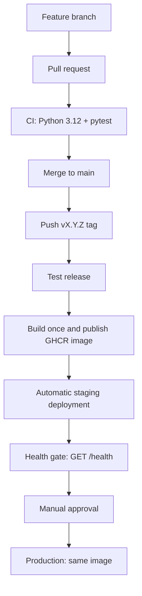

# MLOps Continuous Delivery

A compact Flask inference API for a professional MLOps Continuous Delivery demonstration. A semantic Git tag builds one immutable Docker image, publishes it to GHCR, deploys it automatically to staging, validates `/health`, and promotes the same image to production after GitHub Environment approval.



## API

| Endpoint | Method | Purpose |
| --- | --- | --- |
| `/` | GET | Service status |
| `/health` | GET | Application, model, and release metadata |
| `/predict` | POST | Doubles a numeric `value` |

The final health response contains `application_version: 1.3.0`, `model_version: model-7`, a build-injected actual `git_commit`, and `status: healthy`.

## Local development and Docker

Python 3.12 is used in CI and the image. Dependencies are pinned in `requirements.txt`.

```bash
python -m venv .venv
.venv/bin/pip install -r requirements.txt
.venv/bin/pytest
docker build --build-arg GIT_COMMIT="$(git rev-parse --short HEAD)" -t mlops-continuous-delivery:local .
docker run --rm -p 5000:5000 mlops-continuous-delivery:local
```

## CI, CD, and GHCR

`.github/workflows/ci.yml` runs only for pull requests to `main`; it cannot publish images or deploy. `.github/workflows/cd.yml` runs only for tags matching `v*.*.*`, validates `VERSION`, tests, builds once, then publishes both `ghcr.io/cheemaboi/mlops-continuous-delivery:<version>` and `:latest`.

Staging and production use only the explicit semantic tag, never `latest`. A retrying staging `/health` request blocks production on failure. GitHub Environment `production` provides the approval gate.

| Environment | Required secrets |
| --- | --- |
| `staging` | `STAGING_HOST`, `STAGING_USER`, `STAGING_SSH_KEY` |
| `production` | `PRODUCTION_HOST`, `PRODUCTION_USER`, `PRODUCTION_SSH_KEY` |

Target hosts must be able to pull the GHCR package: make it public or authenticate with a `read:packages` token.

## Versioning, traceability, and rollback

`v1.2.0` is the known-good `model-6` release; `v1.3.0` is `model-7`. The release build injects `git rev-parse --short HEAD`; `/health` exposes it as `git_commit`.

To rollback without a rebuild:

```bash
docker pull ghcr.io/cheemaboi/mlops-continuous-delivery:1.2.0
docker stop mlops-api
docker rm mlops-api
docker run -d --name mlops-api --restart unless-stopped -p 5000:5000 ghcr.io/cheemaboi/mlops-continuous-delivery:1.2.0
curl --fail http://localhost:5000/health
```

Restore `1.3.0` using its existing immutable tag.
